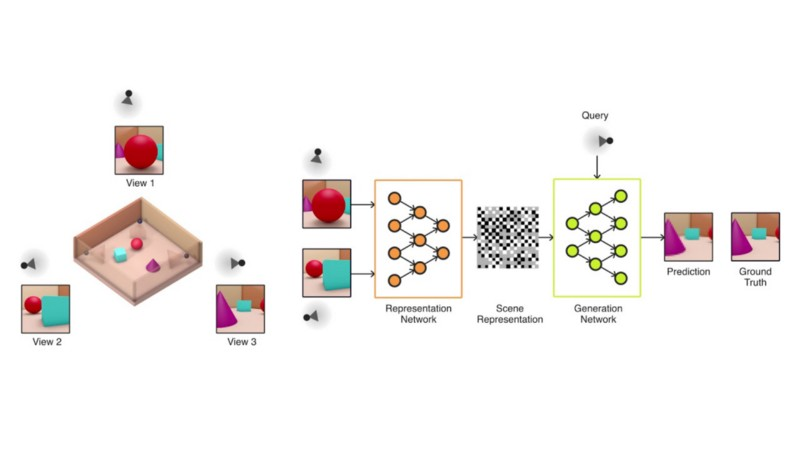
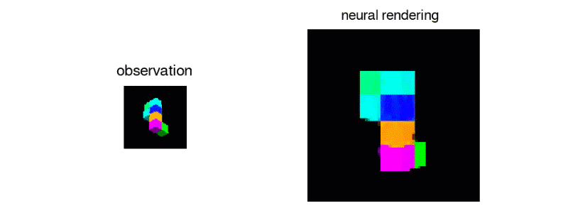

# Generative Query Networks(GQNs)
Deep mind paper on **Neural scene representation and rendering**  

**To understand a visual scene our brains draw on prior knowledge to reason and to make inferences. When entering a room for the first time, we instantly recognise almost everything inside there. If we see an object partially then also we imagine about the probable structure and properties of that missing part. And after watching a scene from one viewpoint we can imagine how it looks from a different perspective. So all these are our abilities but to do all this it requires a very good intuition about lighting, shape, direction, depth, spatial dimensions, time, material properties, colour, and a lot of other stuffs. So if we have to design a machine that can operate in real world like us or may be better, it should be able to understand the surroundings like we do: Where is the light source? What are probable weights of different objects? What material they are made of? Soft or hard?**

Yes, GQNs are useful for these kinds of stuffs. Name GQN seems very fancy, lets see what it has got.

``GQN sees a scene from some viewpoints and then it can imagine the scene from many other viewpoints.``

GQN is a framework within which machines learn to perceive their surroundings by training only on data obtained by themselves as they move around scenes. Much like infants and animals, the GQN learns by trying to make sense of its observations of the world around it. In doing so, the GQN learns about plausible scenes and their geometrical properties, without any human labelling of the contents of scenes.

``GQN model = Representation network + Generation network
Agent's observation → Representation Network → Representation vector
Representation vector → Generation Network → Generated output``

Representation network takes the agent's observations as its input and produces a representation (a vector) which describes the underlying scene. The generation network then predicts ('imagines') the scene from a previously unobserved viewpoint.

The representation network does not know which viewpoints the generation network will be asked to predict, so it must find an efficient way of describing the true layout of the scene as accurately as possible. It does this by capturing the most important elements, such as object positions, colours and the room layout, in a concise distributed representation. During training, the generator learns about typical objects, features, relationships and regularities in the environment. This shared set of 'concepts' enables the representation network to describe the scene in a highly compressed, abstract manner, leaving it to the generation network to fill in the details where necessary. For instance, the representation network will succinctly represent 'blue cube' as a small set of numbers and the generation network will know how that manifests itself as pixels from a particular viewpoint.
